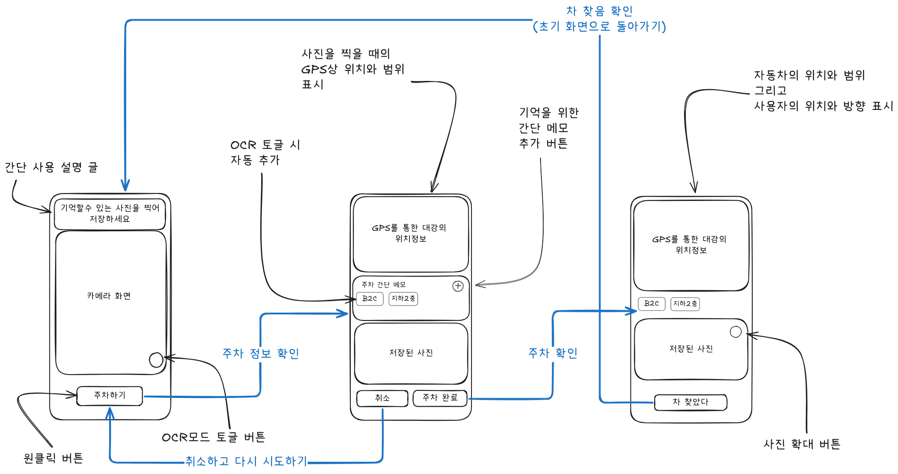

# 어디 주차했지? 🚗

주차할 때마다 사진을 찍고 사진을 다시 찾는 과정을 없애기 위한 스마트 주차 기록 앱입니다.

## ✨ 주요 기능

- 📸 **원터치 주차 기록**: 카메라와 GPS를 활용한 즉시 주차 위치 저장
- 🗺️ **지도 연동**: 정확한 주차 위치를 지도에서 확인
- 📝 **메모 기능**: 주차 위치에 대한 추가 정보 기록
- 🌙 **다크모드 지원**: 시간과 환경에 따른 편안한 사용
- 🎨 **브랜드 디자인**: 친근한 노란 자동차 캐릭터 기반 UI

## 🎨 디자인 컨셉

앱의 디자인은 친근하고 귀여운 노란 자동차 캐릭터를 중심으로 합니다:
- **메인 컬러**: 브랜드 블루 (#4A90E2)
- **액센트 컬러**: 브랜드 옐로우 (#FFD700)  
- **서브 컬러**: 다크 블루 (#2C5282), 라이트 블루 (#90C2F0)

## 🛠️ 기술 스택

- **React Native** + **Expo** - 크로스 플랫폼 모바일 앱
- **TypeScript** - 타입 안정성
- **Expo Camera** - 카메라 기능
- **Expo Location** - GPS 위치 서비스
- **React Native Maps** - 지도 표시
- **AsyncStorage** - 로컬 데이터 저장
- **Linear Gradient** - 아름다운 그라데이션 UI

## 📱 주요 화면

1. **메인 화면**: 권한 요청 및 주차 기록
2. **카메라 화면**: 주차 위치 사진 촬영
3. **주차 정보 화면**: 저장된 위치, 사진, 메모 확인

## 🚀 시작하기

### 필요 조건
- Node.js (16.x 이상)
- Expo CLI
- iOS Simulator 또는 Android Emulator

### 설치 및 실행
```bash
# 의존성 설치
bun install

# 개발 서버 시작
bun start

# iOS에서 실행
bun run ios

# Android에서 실행  
bun run android
```

## 📋 권한 요구사항

- **카메라 권한**: 주차 위치 사진 촬영
- **위치 권한**: 정확한 GPS 좌표 저장

## 🔧 주요 컴포넌트

- `InfoComponent`: 안내 정보 표시
- `CameraComponent`: 카메라 뷰 제공
- `ButtonComponent`: 주차 기록 버튼
- `MapComponent`: 지도 표시
- `MemoComponent`: 메모 작성/편집
- `ImageComponent`: 저장된 사진 표시

## 🎯 향후 계획

- [ ] 다중 주차 위치 저장
- [ ] 주차 시간 알림 기능
- [ ] 주차료 계산기
- [ ] 친구들과 위치 공유
- [ ] Apple Watch / Wear OS 연동


